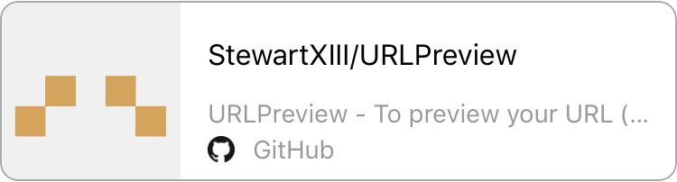
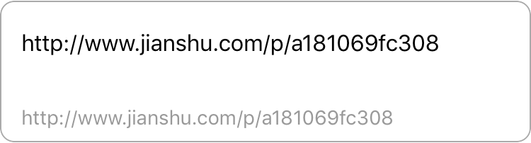

# URLPreviewPod

[](https://developer.apple.com/iphone/index.action)
[](http://cocoapods.org/pods/URLPreviewPod)
[](http://cocoapods.org/pods/URLPreviewPod)

## Layouts

- Default



- Change Color


- No og:title but have title


- No response or tag (og:) 



## Installation
###Use CocoaPods :

(還沒準備好)使用cocoapods安裝，加入指令到專案的Podfile:

(Is not ready for use cocoapods, please download add framework in your project)
URLPreviewPod is available through [CocoaPods](http://cocoapods.org). To install
it, simply add the following line to your Podfile:

```ruby
pod "URLPreviewPod"
```

***

###Add With Framework :

下載專案複製Framework進入你的專案

Download Project and copy Framework in your Project

***

### 安裝 :

1.Linked Framworks and Libraries -> 新增本Framework、libxml2.(dylib/tbd)

2.Build Settings -> Header Search Paths -> 新增 /usr/include/libxml2

3.Build Phases -> Copy Boundle Resources -> 新增本Framework

### Install :

1.Linked Framworks and Libraries -> Add this Framework and libxml2.(dylib/tbd)

2.Build Settings -> Header Search Paths -> Add /usr/include/libxml2

3.Build Phases -> Copy Boundle Resources -> Add this Framework

***

### 使用 :

1.請先用initWithFrame初始化物件(最低尺寸 -> 寬：>=300，高：>=100)

2.如果需要點擊後導到該網站，請設定delegate，並實作URLPreviewDelegate的方法

3.使用saveTemporaryImage判斷是否暫存圖片

4.用showURLPreviewWithURL放入您的網址

### Use :

1.First use initWithFrame init you'r object(Minimum size -> Width：>=300，Height：>=100)

2.If you need to push to you'r URL, set URLPreviewDelegate

3.Use saveTemporaryImage to save Image

4.Use function showURLPreviewWithURL to set you'r URL

## Code
```objective-c
#import <URLPreview/Preview.h>

Preview *preview = [[Preview alloc] initWithFrame:CGRectMake(0, 0, self.view.bounds.size.width, 100)];
preview.center = self.view.center;
preview.delegate = self;
[preview showURLPreviewWithURL:@"https://github.com/StewartXIII/URLPreview"];
```

## Special Thanks
- [Objective-C-HMTL-Parser](https://github.com/zootreeves/Objective-C-HMTL-Parser) is a great HTML parser for Objective-c. (Created by [@zootreeves](https://github.com/zootreeves))

## Author

Stewart, rulerxiii@gmail.com

## License

URLPreviewPod is available under the MIT license. See the LICENSE file for more info.
